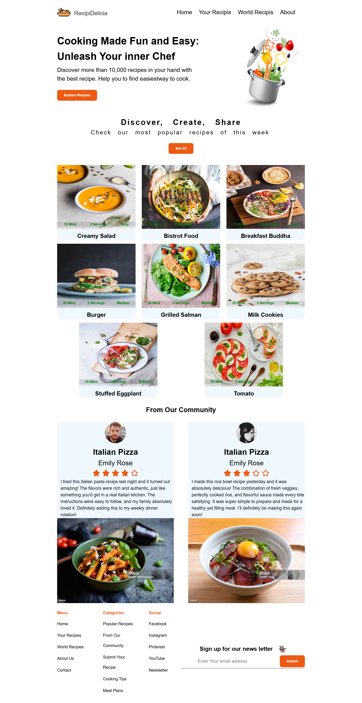

# 🍴 Recipe Manager

A simple recipe manager app built with **Vanilla JavaScript**, **HTML**, and **CSS**.  
It allows users to add, display, and manage recipes dynamically with a modal-based form.

---

## ✨ Features

- ➕ Add new recipes with details (dish name, cooking time, servings, difficulty, image).
- 🖼️ Supports **image upload** (with default image fallback).
- 📄 Recipes displayed as interactive cards.
- ❌ Form validation (all fields required).
- 🎨 Clean UI with modal for adding recipes.
- 🗂️ Modular JavaScript architecture (`app.js`, `dom.js`, `data.js`, `events.js`, `utils.js`).

---

## 🛠️ Tech Stack

- **HTML5** – Structure
- **CSS3** – Styling
- **JavaScript (ES6 Modules)** – Functionality
- **Git & GitHub** – Version control

---

## 📂 Project Structure

```
├── index.html
├── style.css
├── assets/
│   └── images/ (default.jpg, recipe images)
├── js/
│   ├── app.js       # Entry point
│   ├── dom.js       # DOM selectors and exports
│   ├── data.js      # State management (array of recipes)
│   ├── events.js    # Event listeners
│   └── utils.js     # Helper functions (UI rendering, modal handling)
```

---

## 🚀 Getting Started

1. Clone this repository:
   ```bash
   git clone https://github.com/rehmali/https://github.com/rehmali/recipe-manager-app.git
   ```
2. Open `index.html` in your browser.
3. Click **Add Recipe** to create your first recipe!

---



## 🔮 Future Improvements

- ✅ Add **localStorage** to persist recipes.
- ✅ Edit/Delete recipe functionality.
- ✅ Add filtering & sorting (by time, servings, difficulty).
- ✅ Responsive design improvements.

---

## 👨‍💻 Author

Built with ❤️ by **[Rehm Ali](https://github.com/rehmali)**
